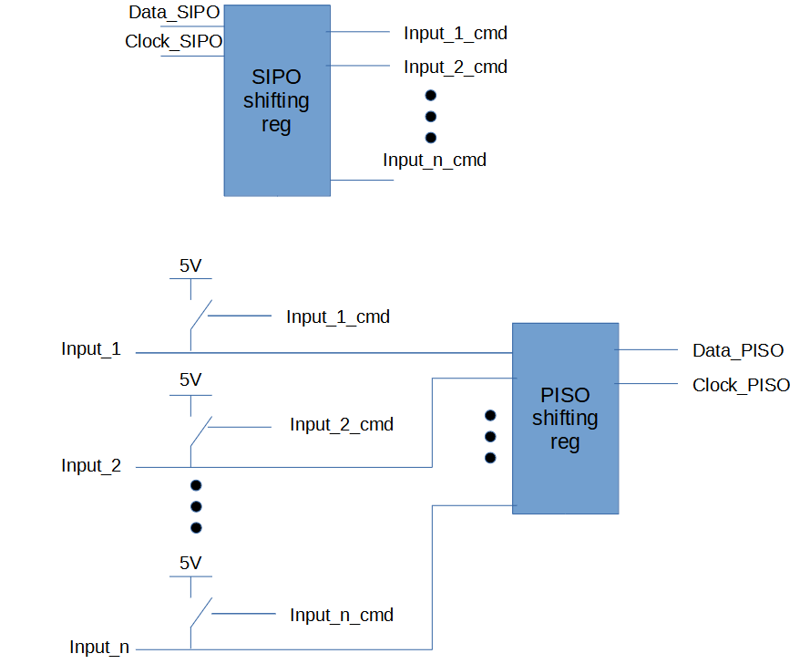
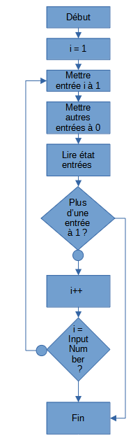

# ShortCircuitBuster
This project is intended to detect short circuit between signals.

## HW architecture
The hardware is based on SIPO shifting register to connect high level potential to the input.
A PISO shifting register permits to read the logic level of the input.

HW architecture is summed: 

## SW Flowchart

The SW flowchart is the following:

"Plain" text translation of the flowchart is:

- Mettre entrée 1 à 1 (via SIPO)
- Mettre autres entrées à 0 (via SIPO et pull down)
- Lire état de toutes les entrées (via PISO)
- Si plus d’une entrée est à 1 : court-circuit, arrêt du test
- Sinon on continue pour balayer toutes les combinaisons

 
- Le MCU logue les résultats afin de rapidement trouver le court-circuit 

## Test additional connections
The use of shifting register make the addition of connections to be tested very easy.
Moreover, extra care has be taken during SW design to easily add as many input as you need !
